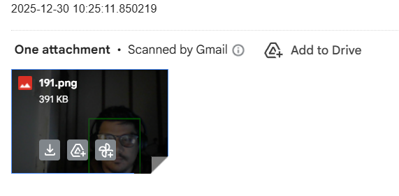

# Motion Detection System with Email Alerts

## Overview
A motion detection system that monitors video from a webcam. When motion is detected, it captures images and sends an email notification with the most recent image. The system automatically cleans the images folder after sending the email.

## Features
- Real-time motion detection using OpenCV
- Automatic image capture during motion events
- Email notification with captured image
- Automatic cleanup of captured images
- Configurable motion detection sensitivity

## Installation

### Prerequisites
- Python 3.11
- Webcam access
- Gmail account with enabled "Less secure apps" or App Password (for email functionality)

### Setup Instructions

1. Clone the repository:
   ```bash
   git clone https://github.com/vinaykumarkv/motion-detection.git
   cd motion-detection
   ```

2. Create and activate a virtual environment:
   ```bash
   python -m venv venv
   source venv/bin/activate  # Linux/macOS
   # venv\Scripts\activate    # Windows
   ```

3. Install required packages:
   ```bash
   pip install opencv-python numpy python-dotenv smtplib ssl email
   ```

4. Set up environment variables (create a `.env` file in the project root):
   ```env
   # Your email credentials
   sender="your_email@gmail.com"
   receiver="your_email@gmail.com"
   password="your_email_password"
   ```

## Configuration

### Motion Detection Threshold
The system uses a threshold of 30 for motion detection. To adjust sensitivity:

1. Edit `main.py`
2. Change the value in this line:
   ```python
   thresh_frame = cv2.threshold(delta, 30, 255, cv2.THRESH_BINARY)[1]
   ```

### Image Capture Settings
- The system captures images every time motion is detected
- Images are saved in the `images` folder
- The email sends the *middle* image of the captured sequence (if multiple images are taken)

## How to Use

1. **Run the motion detection system**:
   ```bash
   python main.py
   ```

2. **View the camera feed**:
   - You'll see the live video feed window (label "Frame")
   - You'll also see the motion detection frames (label "Frame_dilate")

3. **Test the motion detection**:
   - Move in front of the camera to trigger the system
   - The system will capture images when motion is detected

4. **Stop the application**:
   - Press 'q' key in the video window to exit

## How It Works

1. The system captures video from the webcam
2. It processes frames to detect motion using:
   - Gaussian blur
   - Frame differencing
   - Thresholding
   - Contour detection
3. When motion is detected:
   - The system captures an image
   - It stores the image in the `images` folder
4. When motion stops:
   - The system sends an email with the most recent image
   - It cleans the images folder

## Email Configuration Notes

For Gmail:
- You must enable "Less secure apps" or create an [App Password](https://myaccount.google.com/apppasswords)
- Your email password should be set in the `.env` file

## Sample Screenshots




## Project Structure

```
motion-detection/
├── main.py          # Main motion detection application
├── emailer.py       # Email sending functionality
├── .env             # Environment variables
└── images/          # Folder for captured imagesn
```

## Contributing
Pull requests are welcome! For major changes, please open an issue first to discuss what you would like to change.

## License
This project is licensed under the MIT License - see the [LICENSE](LICENSE) file for details.

## Troubleshooting

- **Webcam not detected**: Check your webcam permissions and ensure you're running the app from the correct directory
- **Email not sending**: Verify your Gmail credentials are correct and that "Less secure apps" is enabled
- **No motion detected**: Lower the motion threshold in `main.py` (increase the number in `threshold(delta, 30, ...)`)

> **Note**: For security purposes, it's recommended to:
> 1. Run this application only when needed
> 2. Set up proper firewall rules
> 3. Use a dedicated email account for notifications